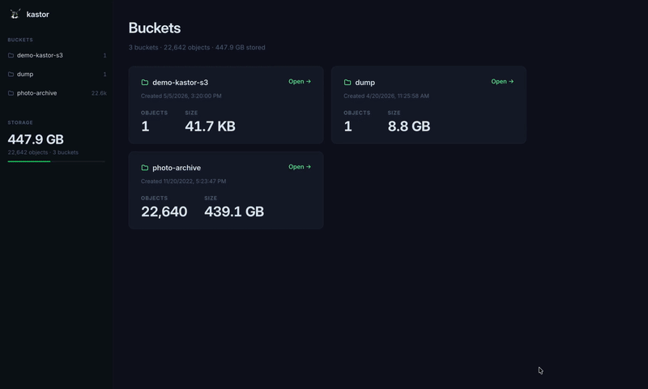
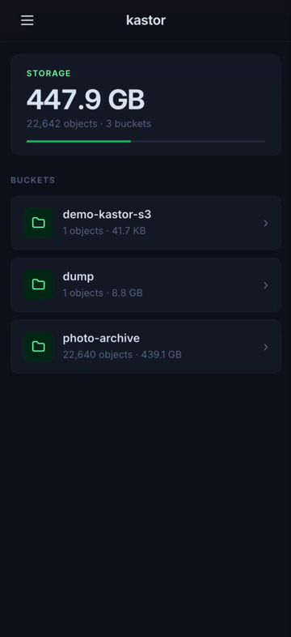

# Kastor S3

[](https://revolut.me/andrirzfr)


☝️ _this is Kastor btw_

A personal web-based file manager for S3-compatible storage. Browse buckets, upload and download files and delete objects — all from a clean browser UI.

## Demo

**Desktop** — full controls: upload, download, delete, gallery view, image preview



**Mobile** — responsive read-only view for browsing on the go



## Quick start

**Prerequisites:** Docker.

```bash
docker pull projectionist/kastor-s3 && docker run -p 7778:80 \
  -e S3_ACCESS_KEY_ID=<key> \
  -e S3_SECRET_ACCESS_KEY=<secret> \
  -e S3_ENDPOINT=<endpoint> \
  -e S3_REGION=<region> \
  projectionist/kastor-s3
```

Open `http://localhost:7778`.

### Environment variables

| Variable               | Required | Description                                                |
| ---------------------- | -------- | ---------------------------------------------------------- |
| `S3_ACCESS_KEY_ID`     | Yes      | S3 access key                                              |
| `S3_SECRET_ACCESS_KEY` | Yes      | S3 secret key                                              |
| `S3_ENDPOINT`          | Yes      | S3-compatible endpoint URL                                 |
| `S3_REGION`            | Yes      | S3 region                                                  |
| `AUTH_USERNAME`        | No       | Basic Auth username (required when `AUTH_PASSWORD` is set) |
| `AUTH_PASSWORD`        | No       | Basic Auth password — enables password protection when set |

### Password protection

To restrict access with HTTP Basic Auth, set both `AUTH_USERNAME` and `AUTH_PASSWORD`:

```bash
docker run -p 7778:80 \
  -e S3_ACCESS_KEY_ID=<key> \
  -e S3_SECRET_ACCESS_KEY=<secret> \
  -e S3_ENDPOINT=<endpoint> \
  -e S3_REGION=<region> \
  -e AUTH_USERNAME=<username> \
  -e AUTH_PASSWORD=<password> \
  projectionist/kastor-s3
```

When `AUTH_PASSWORD` is set the browser will prompt for credentials. All pages and API calls are protected. When neither variable is set the app is publicly accessible, as before.

> Basic Auth sends credentials on every request as a Base64-encoded header. Use it behind HTTPS only (e.g. Caddy, Traefik, or a cloud load balancer in front of the container).

## Features

- Browse buckets and navigate object prefixes as folders
- Upload files or entire folders with progress tracking
- Download single files or entire folders as ZIP
- Delete objects and folders with confirmation
- Preview files inline — images are rendered
- Gallery view for image-heavy folders
- Navigate between files with prev/next arrows in the preview page
- Calculate folder size on demand
- Responsive UI — mobile is read-only; desktop has full controls

## Stack

| Layer      | Technology                                   |
| ---------- | -------------------------------------------- |
| Frontend   | Vite + React 19 + Mantine 7 + React Router 7 |
| Backend    | Bun + Hono 4 + AWS SDK v3                    |
| Deployment | Single Docker image (nginx + Bun API)        |

## Development

Requires [Bun](https://bun.sh).

```bash
# Install dependencies
bun install

# Start backend (api/)
cd api && bun run dev

# Start frontend (frontend/)
cd frontend && bun run dev

# Lint + format (repo root)
bun run fix
```

## Testing

```bash
# All tests (API + frontend + entrypoint shell tests)
bun run test

# Frontend only (Vitest)
cd frontend && bun run test

# Backend only (Bun test runner)
cd api && bun test
```
